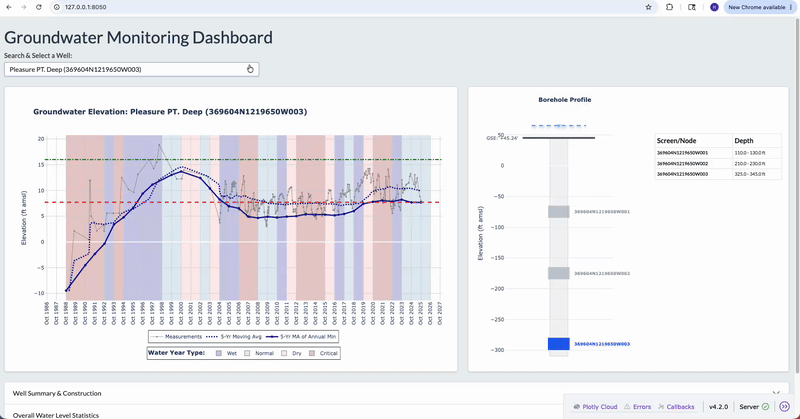
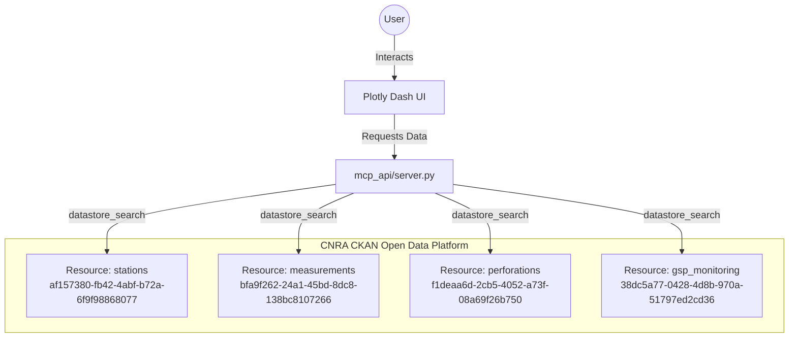

# 💧 CNRA Groundwater Dashboard & MCP Server


A lightweight Model Context Protocol (MCP) data pipeline and interactive Plotly Dash dashboard for fetching, rendering, and analyzing California Natural Resources Agency (CNRA) SGMA groundwater telemetry.

## 📖 About This Project

Managing water resources effectively requires seamless access to historical and real-time telemetry. This project was developed to bridge the gap between raw, distributed state databases and actionable visual insights. 

Built to assist in monitoring compliance and trends under California's Sustainable Groundwater Management Act (SGMA), this application provides an interactive, accessible window into the state's groundwater networks.

**Key Capabilities:**
* **Real-Time API Ingestion:** Bypasses static CSV downloads by querying the CNRA CKAN datastore dynamically, handling pagination and custom SQL execution under the hood.
* **Interactive Hydrographs:** Allows users to visualize decades of groundwater elevation measurements instantly.
* **Well Construction Profiling:** Cross-references telemetry with physical well perforation data to provide full-picture geological context.

Whether you are a water resource manager, a data researcher, or an agency stakeholder, this tool is designed to make complex hydro-data highly accessible without requiring a technical background.

## 🚀 Live Demo



**Try the interactive dashboard here:** [https://cnra-gw-dashboard.onrender.com/](https://cnra-gw-dashboard.onrender.com/)

*(Note: This application is hosted on Render's free tier. If it hasn't been accessed in the last 15 minutes, the server goes to sleep. It may take 30–50 seconds to "wake up" when you first click the link!)*

---

## 💻 Tech Stack
This project leverages a decoupled architecture, separating the API data engine from the frontend interface:

**Frontend / User Interface**
* **Plotly Dash:** For building the interactive, analytical web application.
* **Dash Bootstrap Components:** For responsive, clean CSS grid layouts.

**Backend / Data Engine**
* **Python & Asyncio:** For handling concurrent data fetching without blocking the main server thread.
* **Model Context Protocol (MCP):** A lightweight server architecture managing precise data contracts with external APIs.
* **CNRA CKAN API:** The direct state database providing the SGMA groundwater elevation telemetry and well perforations.

**Production & Deployment**
* **Gunicorn / Flask:** The heavy-duty WSGI HTTP server executing the dynamic Dash layout.
* **Render:** Cloud platform providing continuous deployment directly from the main branch.
  
---

## 🏗️ Project Architecture



This is a Monorepo containing two distinct modules:

* **`/mcp_api` (The Data Engine):** A lightweight server that interfaces asynchronously with CNRA and CKAN APIs to fetch groundwater elevation, station data, and well perforations.
* **`/dashboard` (The User Interface):** A Plotly Dash application that imports data from the `mcp_api` to generate interactive hydrographs and well construction profiles.

---

## 🚀 Installation & Setup

Because this project isolates the backend and frontend, it utilizes two separate `requirements.txt` files. 

**1. Clone the repository**
```bash
git clone [https://github.com/yourusername/cnra-groundwater-dashboard.git](https://github.com/yourusername/cnra-groundwater-dashboard.git)
cd cnra-groundwater-dashboard

```

**2. Install the backend (MCP) dependencies**

```bash
pip install -r mcp_api/requirements.txt

```

**3. Install the frontend (Dashboard) dependencies**

```bash
pip install -r dashboard/requirements.txt

```

*(Note: If you are running this locally on a single machine, you can install both into the same Python virtual environment).*

---

## 🖥️ Using the Dashboards

This repository offers two different ways to explore groundwater data visually. **Always run these scripts from the root directory of the project** so the Python path routing works correctly.

### 1. The Dynamic Explorer (`app.py`)

This is a "Just-In-Time" interactive dashboard. It boots up instantly and provides a searchable dropdown menu of active SGMA monitoring wells. When you select a well, the app dynamically reaches out to the CNRA API and loads the visuals on the fly.

**How to run:**

```bash
python dashboard/app.py

```

* **Access:** `http://127.0.0.1:8050`
* **Best for:** Broad exploration, quickly clicking through different wells, and general monitoring.

### 2. The Standalone Deep-Dive (`app_standalone.py`)

This is a "Pre-Built" CLI tool. It fetches all the data for a specific well in your terminal *before* booting the web server. Once the data is compiled, it launches a highly responsive, zero-latency dashboard.

**How to run:**

```bash
python dashboard/app_standalone.py

```

* **Access:** `http://127.0.0.1:8051`
* **Best for:** Deep-dive analysis on a single well where you want maximum UI performance without waiting for network loading spinners.

---

## 📊 Dashboard Components

Once you launch either dashboard, you will have access to three primary interactive components:

* **Interactive Hydrograph:** A dynamic time-series chart showing groundwater elevations over time. Hovering over data points on this graph automatically syncs with the Well Profile Sketch.
* **Well Profile Sketch & Construction Table:** A visual representation of the borehole, showing ground surface elevation (GSE) and screen intervals (perforations). As you hover over the Hydrograph, the dynamic water level in the sketch updates in real-time.
* **Metadata Accordions:** Expandable data tables at the bottom of the page containing raw datasets, station information, and GSP monitoring details.

---

## ⚙️ Using the MCP Server Tools

The `/mcp_api/server.py` file acts as the central data nervous system. While it currently powers the Dash UI, it is formatted to be consumed by an AI Agent or LLM via the Model Context Protocol.

The server exposes the following core tools:

* **`get_station_info(site_code)`**: Fetches the physical metadata for a specific well (latitude, longitude, total depth, ground surface elevation).
* **`get_measurements(site_code)`**: Retrieves the complete historical time-series of groundwater level measurements for a specific well.
* **`get_records_by_attribute(resource_name, attribute, value)`**: A flexible query tool to fetch filtered data from specific CNRA datasets (like the GSP monitoring network).
* **`get_water_years()`**: Generates California Water Year classifications for time-series overlays.
* **`execute_sql_paginated(sql_query)`**: A raw SQL execution tool for bypassing standard endpoints and querying the CKAN datastore directly.

### To use these tools in your own Python scripts:

Because the `mcp_api` acts as a local package, you can import these data fetchers into any Python script running from the root directory:

```python
import asyncio
from mcp_api.server import get_measurements

async def test_fetch():
    data = await get_measurements("369604N1219650W003")
    print(data)

asyncio.run(test_fetch())

```
## 🤝 Contributing & Contact
Contributions, issues, and feature requests are welcome! If you have questions about the data pipelines, the MCP architecture, or California groundwater telemetry, feel free to reach out.

* **Author:** Hanieh Haeri
* **LinkedIn:** https://www.linkedin.com/in/hanieh-haeri-9319b024/
* **GitHub:** [@hhaeri](https://github.com/hhaeri)

**Project developed for groundwater resource monitoring compliance under California's Sustainable Groundwater Management Act (SGMA).**
